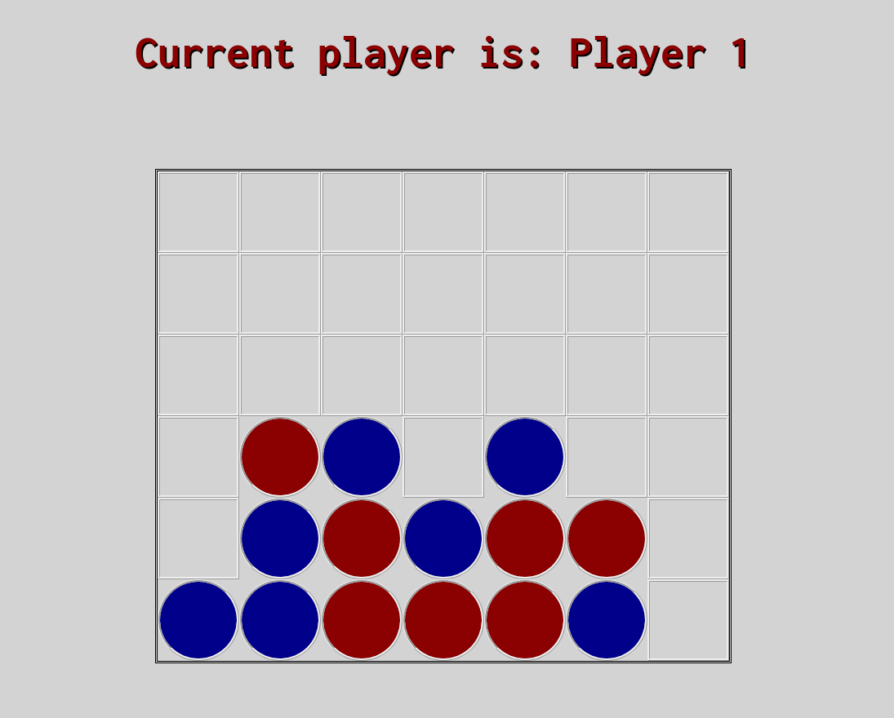

# Connect 4

Classical board-game implementation in vanilla JavaScript with minimalist HTML structure and basic Css style.

## Rules

The game board is made by 7 columns and 6 rows, for a total of 42 empty cells. This game is meant to be played by 2 opponents. Player 1 gets a set of red coins, Player 2 gets a set of blue ones. Each player must place one coin per round, trying to make 4 coins of his own color in a row. Every direction is good: the two diagonals, in a vertical column or in a horizontal row.

__important__: as in the classical board game, a player can place his coin only above another coin (doesn't matter which player's) or in the bottom row.

## Other notes and contacts

To run the game you don't need any particular dependency. All you need is a web browser with JavaScript support.

A screenshot of an example match on desktop browser:

If you have any suggestion/problem/question please email me or open a Github issue.

| Name | Github profile | Email |
|------|----------------|-------|
|Federico Omodei | http://github.com/Fomodei94 | federico.omodei[at]gmail.com